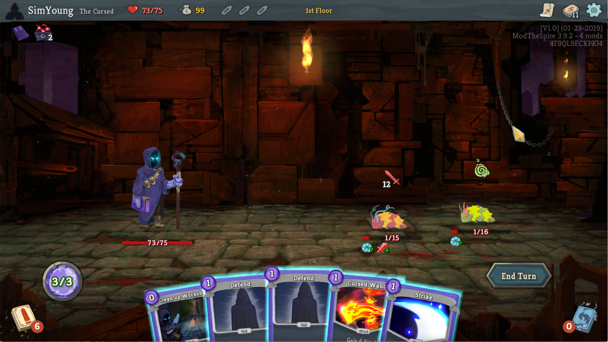

# Slay the Spire Mod - The Cursed

Adds a new character "The Cursed" to Slay the Spire game.

## Introduction
A wanderer corrupted by darkness. Uses curse, magic circle, and sometimes melee weapons.
The Cursed adds 75 cards (plus 1 extra card), 11 new character-specific relics, and 1 new potion.

## Character Mechanism
### "Cursed" cards
Any card with the word "Cursed" in its name. They have better stats than normal cards, but using it will add one or more Curse cards into your hand or draw pile.
### Ritual
When using a Ritual card, choose 1 card to Exhaust. Selecting a Curse card will activate the Ritual's effect.
### Circle
An unplayable card that can be activated by using other cards while in hand.
### Bleed
Bleeding creature loses HP whenever it attacks. Each turn, Bleed is reduced by 1. Some cards can "activate" Bleed which makes the enemy loses HP by Bleed immediately. 

## Known Issues
- Googly Eyes mod is not fully supported. The character in combat is just a single png file, and it’s unable to add an eye on it.

## Credit
Special thanks to 히말군 for character artwork.

French translation by Demotion

Spanish translation by Minaderm